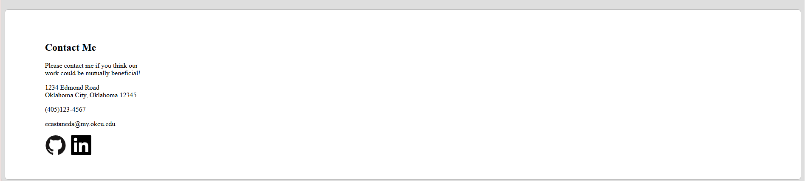

# Homepage
homepage app created for spring 2025 advanced web design project 2
project requirements listed on the odin project webpage:
(https://www.theodinproject.com/lessons/node-path-advanced-html-and-css-homepage)

project may be viewed by visiting the url: https://frogbeth.github.io/Homepage/
or by cloning the repository code onto your local machine and running index.html.

this homepage consists of mostly placeholder text and links, and I will update it as I need to.

this project was created using html, css, and javascript.
