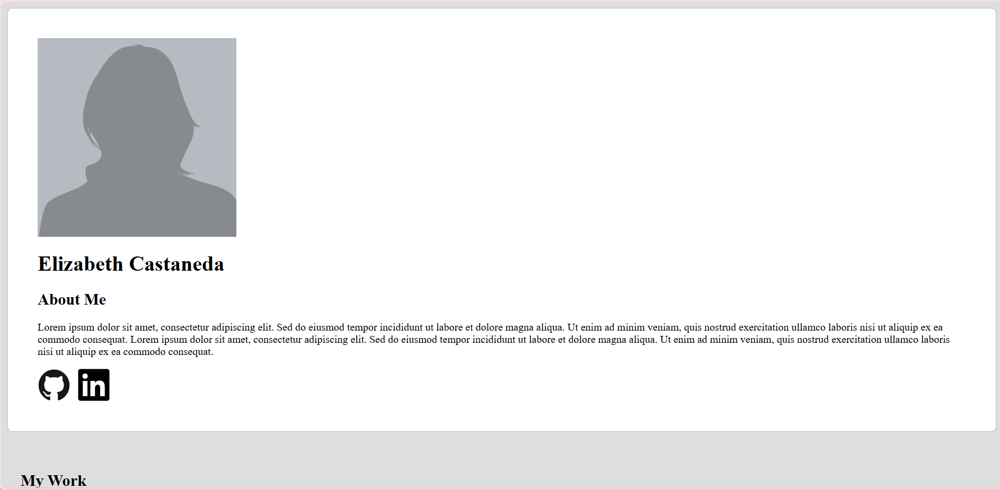

# Homepage
homepage app created for spring 2025 advanced web design project 2
project requirements listed on the odin project webpage:
(https://www.theodinproject.com/lessons/node-path-advanced-html-and-css-homepage)

project may be viewed by visiting the url: https://frogbeth.github.io/Homepage/
or by cloning the repository code onto your local machine and running index.html.

on this page, a short "about me" paragraph is displayed as well as several projects that I have completed
click the panels displaying my projects to view each project with more detail in its own browser tab
the clickable animated icons in the header and footer contain my contact information and social media links

this project was created using html, css, and javascript.
